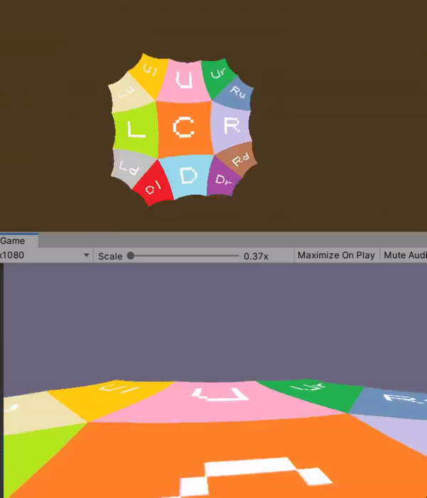

# HyperbolicTileMapping
Unity Engine extension as custom package that allows Unity to render and move the Hyperbolic Plane using tile maps.
[Leia-me em Portugês](README-pt.md)

## Installation
Using Unity package manager, select: **Add package from git URL** with the link:
```
https://github.com/paulogcosta/HyperbolicTileMapping.git?path=/Assets/Release
```
or download the **.unitypackage** from the last release at [releases page](https://github.com/paulogcosta/HyperbolicTileMapping/releases/tag/1.0.0)

## Usage
At first, create the tile objects that you will use and assign the [subdivided plane](https://github.com/paulogcosta/HyperbolicTileMapping/blob/main/Assets/Release/Resources/Prefabs/5SubvidisionSquareTile.prefab) prefab or a custom plane prefab, and assign a texture to it.


Now create the Chunk Object and assign the Tile Objects you will use and change the **ChunkMap** field to set the position of your tile inside the chunk.


Currently you can set just 13 tiles to a chunk, following the pattern below, but you can extend it to use chunk of chunks.


To render and move the chunk you will need just to call the public method **Initialize** of your Chunk Object, and use the horizontal and vertical axis to move it.


